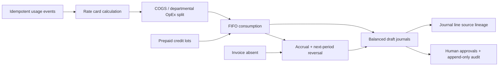

# Spendify

Spendify is a deterministic month-end close foundation for AI and cloud spend. This first vertical slice rates provider usage, consumes prepaid credits, identifies an unbilled remainder, and produces balanced draft journals with source-to-line lineage.

The demo intentionally stops before authentication, LLM workflows, ERP posting, and dashboard polish. R&D usage is always proposed as departmental OpEx; the system opens a human-review exception and never capitalizes it automatically.

## Demo scenario

The seeded August 2026 close uses one provider, **Northstar AI**, at `$2.00 / 1M tokens`:

| Usage | Quantity | Classification | Exact cost |
| --- | ---: | --- | ---: |
| Customer-facing | 4,000,000,000 tokens | 6100 · AI cost of revenue | $8,000.00 |
| Internal R&D | 2,000,000,000 tokens | 7200 · Departmental AI expense | $4,000.00 |
| **Total** | **6,000,000,000 tokens** | | **$12,000.00** |

A single `$10,000.00` prepaid lot is consumed FIFO. With no invoice received at month-end, the remaining `$2,000.00` becomes a missing-invoice accrual and reverses on September 1.

Draft journal output:

1. Debit COGS `$8,000.00`, debit R&D OpEx `$2,000.00`, credit prepaid credits `$10,000.00`.
2. Debit R&D OpEx `$2,000.00`, credit accrued provider payable `$2,000.00`.
3. Reverse entry 2 on the first day of the next period.

Every debit and credit is stored as integer micros and every journal line links to its originating usage event.

## Architecture



- `src/domain/models.ts` defines Zod-validated domain contracts for providers, rate cards, usage, invoices, credits, cost centers, close runs, exceptions, journals, approvals, and audit events.
- `src/domain/accounting.ts` contains pure accounting functions. It uses `bigint` exclusively for quantities and money and applies documented round-half-up behavior at the single-micro boundary.
- `src/domain/demo.ts` assembles and validates the deterministic fixture rendered by the App Router server component.
- `supabase/migrations/202609060001_initial_accounting.sql` is the Postgres schema. It enforces non-negative integer micros, idempotency with `unique (provider_id, source_event_id)`, deferred journal balancing, normalized lineage, and append-only audit events.
- `supabase/seed.sql` persists the same demo scenario, including all three balanced journal entries.

All instants use Postgres `timestamptz` and application timestamps are normalized to an ISO 8601 `Z` suffix. Accounting effective dates remain SQL `date` values because they represent ledger periods, not instants.

## Local setup

Prerequisites: Node.js 22+ and npm. Supabase CLI is optional unless you want to run the schema locally.

```bash
npm install
cp .env.example .env.local
npm run dev
```

Open [http://localhost:3000](http://localhost:3000). The current demo is computed locally and does not require Supabase credentials.

To create a local database with the optional Supabase CLI:

```bash
supabase start
supabase db reset
```

`supabase db reset` applies the migration and `supabase/seed.sql`. Do not expose `SUPABASE_SERVICE_ROLE_KEY` to client components.

## Verification

```bash
npm run lint
npm test
npm run build
```

Tests assert exact values for rating and rounding, FIFO credit use, account classification, accruals, reversals, journal balance, source lineage, and the seeded close totals.
